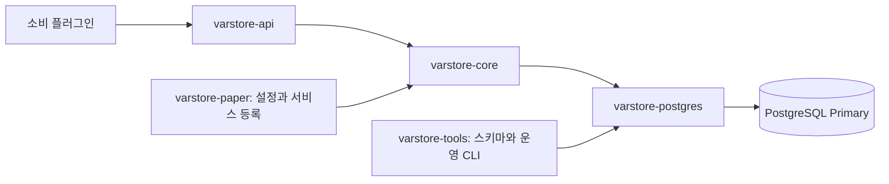

# 개발과 수정 안내

[README로 돌아가기](../README.md) · [설치](setup.md) · [API](api.md)

처음에는 [preferences 예제](../examples/preferences/src/main/java/kr/lunaf/varstore/examples/preferences/PreferencesPlugin.java)에서 서비스 등록 → 키 선택 → 읽기/쓰기 → 완료 처리를 따라가세요. 저장 기능을 사용하는 플러그인이라면 VarStore 내부 코드를 바꾸지 않고 공개 API로 구현할 수 있습니다.

## 수정할 파일 찾기

각 모듈은 `src/main/java`에 구현, `src/test/java`에 시험, `src/main/resources`에 설정·SQL을 둡니다. 패키지의 공통 시작은 `kr.lunaf.varstore`입니다.

| 수정할 기능 | 모듈 / 주요 파일 | 확인할 부분 |
| --- | --- | --- |
| 키·값 타입·공개 결과 계약 | [api](../varstore-api/src/main/java/kr/lunaf/varstore/api/) / `VarStore`, `VarKey`, `ErrorCode` | 기존 소비 플러그인과의 호환성 |
| 요청 큐·비동기 실행 | [core](../varstore-core/src/main/java/kr/lunaf/varstore/core/) / `AsyncVarStore`, `StoreConfig` | 요청 개수·바이트 한도와 완료 전달 |
| 정의·이벤트·동일 ID 복구 | core / `LocalKeyRegistry`, `EventHub`, `PendingWriteManager` | 등록 해제·중복 전달·원래 작업 ID |
| SQL·커밋·잠금 | [postgres](../varstore-postgres/src/main/java/kr/lunaf/varstore/postgres/) / `PostgresBackend`, `OutboxRepository` | 실제 DB 계약 시험 |
| DB 스키마 | [db/](../varstore-postgres/src/main/resources/db/) / `SchemaMigrator` | 새 번호의 마이그레이션과 검증 등록 |
| Paper 설정·서비스 시작 | [paper](../varstore-paper/src/main/java/kr/lunaf/varstore/paper/) / `PaperConfiguration`, `VarStorePlugin` | 기본 config와 설정 파서 함께 수정 |
| 관리자 명령·권한 | paper / `AdminCommand`, [plugin.yml](../varstore-paper/src/main/resources/plugin.yml) | 콘솔 제한·확인 토큰·감사 기록 |
| 플레이어 콜백·이동 | paper / `PaperSessions`, `TrackedWrites` | 메인 스레드·접속 토큰·대기 중 쓰기 |
| 표시 캐시 | [cache](../varstore-cache/src/main/java/kr/lunaf/varstore/cache/) | 무효화·구독·항목/바이트 한도 |
| 객체 인코딩 | [codec](../varstore-codec/src/main/java/kr/lunaf/varstore/codec/) | envelope 크기·schema·불변 snapshot |
| PlaceholderAPI / Skript | [placeholderapi](../varstore-placeholderapi/src/main/) / [skript](../varstore-skript/src/main/) | 허용 namespace·비동기 결과·표시 상태 |
| CLI 운영 도구 | [tools](../varstore-tools/src/main/java/kr/lunaf/varstore/tools/) / `Main`, `CsvDryRun` | 환경 변수·명령 인자·출력 |

저장 요청은 다음 경로를 따라갑니다. 캐시와 애드온은 이 위에 붙는 선택 기능입니다.



## 빌드 설정 수정하기

| 바꾸려는 설정 | 파일 |
| --- | --- |
| 프로젝트 그룹·VarStore 버전·Java·공통 테스트·Paper/Shadow 배포 규칙 | [루트 build.gradle.kts](../build.gradle.kts) |
| 외부 라이브러리·Paper API·JUnit·Shadow 버전 | [gradle/libs.versions.toml](../gradle/libs.versions.toml) |
| 한 모듈의 의존성·전용 task | 각 모듈의 `build.gradle.kts` |
| 모듈 추가·삭제 | [settings.gradle.kts](../settings.gradle.kts) |
| Gradle 메모리·병렬 실행 | [gradle.properties](../gradle.properties) |

예를 들어 PostgreSQL 의존성을 바꾸려면 `varstore-postgres/build.gradle.kts`를, JDBC 드라이버 버전을 바꾸려면 `libs.versions.toml`을 수정합니다. Paper API는 빌드 기준이며 지원 범위는 [실제 검증 기록](testing.md)과 구분합니다.

새 Paper 플러그인 모듈은 `settings.gradle.kts`에 포함하고 루트 `build.gradle.kts`의 `paperProjects`에도 추가합니다. 저장 계약 시험 도우미는 [varstore-testkit](../varstore-testkit/src/main/), 실제 게임 스레드 부하 측정용 플러그인은 [varstore-testkit-paper](../varstore-testkit-paper/src/main/)에 있습니다.

## 빌드와 테스트

소스 저장소 루트에서 JDK 21로 실행합니다. Windows에서는 `./gradlew` 대신 `gradlew.bat`를 사용하세요. Java 25가 기본인 호스트에서도 Gradle 실행에는 Java 21을 지정합니다.

```sh
export JAVA_HOME=/path/to/jdk-21
./gradlew build
```

수정한 모듈부터 확인하려면 다음 명령을 사용합니다.

```sh
./gradlew :varstore-api:test
./gradlew :varstore-paper:test
./gradlew :varstore-postgres:test :varstore-core:test
./gradlew :varstore-paper:assemble :varstore-tools:assemble
```

DB 관련 시험은 아래 환경 변수가 없으면 건너뜁니다. 결과는 각 모듈의 `build/reports/tests/test/index.html`과 `build/test-results/test/`에 있습니다. CI는 PostgreSQL 18로 실제 DB 계약 시험을 실행합니다.

### 로컬 DB로 계약 시험하기

`compose.yaml`은 루프백의 개발용 PostgreSQL입니다. 계약 시험은 테이블 생성·변경과 장애 상황을 다루므로 전용 시험 DB를 사용합니다.

```sh
export VARSTORE_LOCAL_DB_PASSWORD='choose-a-local-test-password'
docker compose up -d
# DB가 accepting connections를 표시한 뒤 시험합니다.
docker compose exec postgres pg_isready -U varstore

export VARSTORE_TEST_JDBC_URL=jdbc:postgresql://127.0.0.1:25432/varstore
export VARSTORE_TEST_DB_USER=varstore
export VARSTORE_TEST_DB_PASSWORD="$VARSTORE_LOCAL_DB_PASSWORD"
./gradlew build
```

로컬 Paper에서도 써보려면 도구에 DB 환경 변수를 전달하고 스키마를 준비합니다. `VARSTORE_TLS_MODE`는 tools 설정이고, Paper는 `plugins/VarStore/config.yml`의 `storage.tls-mode`를 사용합니다.

```sh
export VARSTORE_JDBC_URL="$VARSTORE_TEST_JDBC_URL"
export VARSTORE_DB_USER="$VARSTORE_TEST_DB_USER"
export VARSTORE_DB_PASSWORD="$VARSTORE_TEST_DB_PASSWORD"
VARSTORE_TLS_MODE=disable java -jar varstore-tools/build/libs/varstore-tools-1.3.0.jar migrate production
VARSTORE_TLS_MODE=disable java -jar varstore-tools/build/libs/varstore-tools-1.3.0.jar validate
```

개발용 비TLS DB에 연결하는 Paper 설정만 `storage.tls-mode: disable`로 바꿉니다. 원격 설치의 계정·TLS 설정은 [설치 문서](setup.md)를 따릅니다. 서버·봇·강제 종료·복원 시험은 [테스트 안내](testing.md#시험-실행)에 있습니다.

## 예제를 출발점으로 사용하기

| 예제 | 구현된 흐름 |
| --- | --- |
| [preferences](../examples/preferences/src/main/) | 채팅 알림 설정 조회·CAS 변경·추적한 쓰기 완료 후 이동 |
| [rewards](../examples/rewards/src/main/) | 날짜 조건과 점수를 함께 바꾸는 일일 보상 |
| [quests](../examples/quests/src/main/) | 퀘스트 LONG 증가·조회·prefix 페이지 목록 |
| [structured](../examples/structured/src/main/) | Codec 설정 객체·불변 snapshot·같은 ID 저장 |

기존 migration SQL을 고치면 저장된 체크섬과 충돌합니다. 스키마를 바꿀 때는 새 migration과 검증 절차를 추가하세요. 쓰기 성공/조건 실패/불명확 결과, 조회 없음/오류의 구분은 [저장 계약](api.md#저장-계약)을 기준으로 유지합니다.

## 문서와 배포 확인

처음 사용자가 보는 내용은 `README.md`, 상세 설명은 `docs/`의 해당 문서를 고칩니다. 공개 문서는 이 두 경로에서 관리하며 개인 작업 노트는 공개 트리에 포함하지 않습니다.

```sh
python3 scripts/check-public-tree.py
# 전체 빌드 후 배포 ZIP과 SHA256SUMS를 만듭니다.
python3 scripts/package-release.py
```

배포 ZIP에는 README·docs·JAR·예제 소스·기존 검증 기록이 들어갑니다. 새 시험 결과를 보존하려면 실행한 버전·환경·바이너리 해시를 함께 기록하고, 과거 릴리스 수치와 구분하세요.
